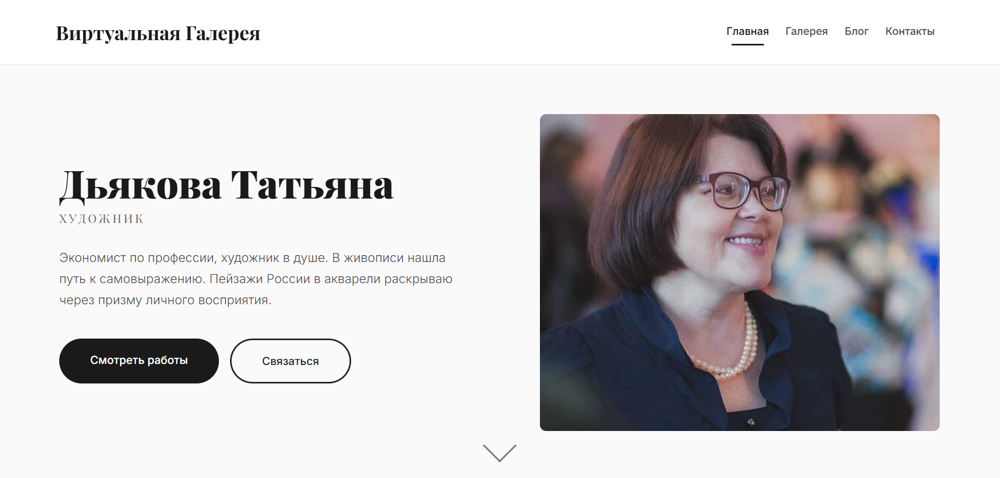
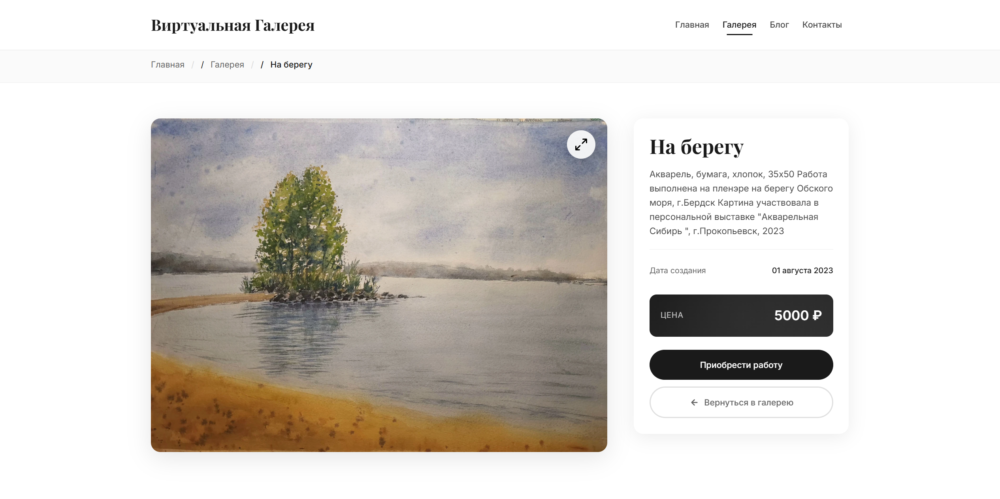

# Virtual Gallery

Веб-приложение для демонстрации художественных работ с каталогом картин, блогом и формой обратной связи.

## О проекте

Virtual Gallery - это персональная художественная галерея, разработанная для представления работ художницы Татьяны Дьяковой в онлайн-формате. Проект реализован с использованием Django и развернут в production-окружении с использованием Docker, Nginx и PostgreSQL.

**Демо:** [tatyana-dyakova.ru](https://tatyana-dyakova.ru)

### Основные возможности

- **Главная страница**: презентация художника с избранными работами
- **Каталог картин**: полный список произведений с сортировкой по дате создания
- **Детальные страницы картин**: подробная информация о каждой работе
- **Блог**: публикация новостей, статей и анонсов художника с поддержкой множественных изображений
- **Форма обратной связи**: возможность отправки сообщений художнику
- **Адаптивный дизайн**: корректное отображение на всех типах устройств

### Технологический стек

- **Backend**: Python 3.13, Django 5.2.4
- **Database**: PostgreSQL 17
- **Server**: Gunicorn 23.0.0, Nginx (stable-alpine)
- **Frontend**: HTML5, CSS3, Django Templates, django-widget-tweaks 1.5.0
- **Image Processing**: Pillow 11.3.0 (автоматическое изменение размера, обрезка, конвертация в WebP)
- **Infrastructure**: Docker & Docker Compose
- **Other**: python-dotenv 1.1.1 (управление переменными окружения)

## Скриншоты интерфейса

### Главная страница

*Главная страница с информацией о художнике и избранными картинами*

### Каталог картин

*Список всех картин с миниатюрами и основной информацией*

### Детальная страница картины

*Детальная информация о картине с изображением в высоком качестве*

## Архитектура данных

Приложение использует следующую структуру моделей данных:

```
Artist (Художник)
    ├── name: CharField - Имя художника
    ├── bio: TextField - Краткая биография
    └── photo: ImageField - Фотография художника

Painting (Картина)
    ├── title: CharField - Название картины
    ├── description: TextField - Описание
    ├── creation_date: DateField - Дата создания
    ├── price: IntegerField - Цена (опционально)
    ├── is_featured: BooleanField - Избранная картина (для главной)
    ├── slug: SlugField - URL-имя (автогенерируется)
    ├── image: ImageField - Оригинальное изображение
    ├── small_image: ImageField - Малое изображение (400x300, автогенерируется)
    ├── medium_image: ImageField - Среднее изображение (800x600, автогенерируется)
    └── large_image: ImageField - Большое изображение (1920px, автогенерируется)

BlogPost (Пост блога)
    ├── title: CharField - Заголовок поста
    ├── content: TextField - Содержание
    ├── pub_date: DateTimeField - Дата публикации
    ├── slug: SlugField - URL-имя (автогенерируется)
    └── cover_image: ImageField - Обложка поста
    
BlogPostImage (Изображения поста)
    ├── post: ForeignKey → BlogPost - Связь с постом
    └── image: ImageField - Изображение для поста

ContactRequest (Заявка на обратную связь)
    ├── name: CharField - Имя отправителя
    ├── email: EmailField - Email отправителя
    ├── message: TextField - Текст сообщения
    └── created_at: DateTimeField - Дата создания

SiteContact (Контактная информация сайта)
    ├── phone: CharField - Телефон
    ├── email: EmailField - Email
    ├── vk_link: URLField - Ссылка на VK
    ├── instagram_link: URLField - Ссылка на Instagram*
    └── telegram_link: URLField - Ссылка на Telegram
```

> **Примечание**: *Деятельность Meta Platforms Inc. и принадлежащих ей социальных сетей Facebook и Instagram запрещена на территории РФ по основаниям осуществления экстремистской деятельности.

## Структура проекта

```
VirtualGallery/
├── virtual_gallery/          # Корневая директория Django проекта
│   ├── core/                 # Основное приложение галереи
│   │   └── management/       
│   │   │   ├── __init__.py
│   │   │   └── commands/                  # Кастомные команды управления
│   │   │       ├── __init__.py
│   │   │       ├── clear_db.py            # Команда очистки БД
│   │   │       └── populate_db.py         # Команда заполнения БД тестовыми данными
│   │   ├── migrations/       # Миграции базы данных
│   │   ├── __init__.py
│   │   ├── admin.py          # Настройки админ-панели
│   │   ├── apps.py           # Конфигурация приложения
│   │   ├── forms.py          # Формы (ContactForm)
│   │   ├── middleware.py     # Middleware для игнорирования DevTools запросов
│   │   ├── models.py         # Модели данных
│   │   ├── signals.py        # Сигналы для автоудаления медиа-файлов
│   │   ├── storage.py        # Кастомное хранилище файлов
│   │   ├── tests.py          # Unit-тесты приложения
│   │   ├── views.py          # Представления
│   │   └── urls.py           # URL-маршруты приложения
│   ├── virtual_gallery/      # Пакет настроек проекта
│   │   └── settings/
│   │   │   ├── __init__.py
│   │   │   ├── base.py       # Общие настройки для всех окружений
│   │   │   ├── dev.py        # Настройки для разработки
│   │   │   └── prod.py       # Настройки для production
│   │   ├── __init__.py
│   │   ├── asgi.py           # ASGI для dev (→ dev settings)
│   │   ├── wsgi.py           # WSGI для production (→ prod settings)
│   │   └── urls.py           # Корневые URL-маршруты
│   ├── templates/            # Общие шаблоны проекта
│   │   ├── base.html         # Базовый шаблон
│   │   └── core/
│   │       ├── home.html              # Главная страница
│   │       ├── painting_list.html     # Каталог картин
│   │       ├── painting_detail.html   # Детальная страница картины
│   │       ├── blog_list.html         # Список постов блога
│   │       └── contacts.html          # Страница контактов
│   ├── media/                # Загруженные файлы (изображения)
│   │   ├── artist/           # Фото художника
│   │   ├── sample_images/    # Фото для заполнения БД через commands/populate_db.py
│   │   └── paintings/
│   │   │   ├── original/     # Оригинальные изображения картин
│   │   │   ├── small/        # Малые версии (400x300)
│   │   │   ├── medium/       # Средние версии (800x600)
│   │   │   └── large/        # Большие версии (1920px)
│   │   └── blog/
│   │       ├── covers/       # Обложки постов
│   │       └── images/       # Изображения для постов
│   ├── static/               # Статические файлы (CSS, JS, изображения)
│   ├── Dockerfile            # Сборка Docker-контейнера Django
│   ├── manage.py             # Утилита управления Django
│   └── requirements.txt      # Python зависимости
├── nginx/                    # Конфигурация Nginx
│   └── ssl/                  # SSL сертификаты (не в git)
│   │   ├── fullchain.pem     # Полная цепочка сертификатов
│   │   └── privkey.pem       # Приватный ключ
│   └── nginx.conf            # Конфигурация веб-сервера
├── docs/                     # Документация и скриншоты
│   └── screenshots/          # Скриншоты интерфейса
│       ├── home.png          # Скриншот главной страницы
│       ├── catalog.png       # Скриншот каталога
│       └── painting.png      # Скриншот детальной страницы
├── .env                      # Переменные окружения (не в git)
├── .env.example              # Пример переменных окружения
├── .gitignore                # Игнорируемые файлы для git
├── docker-compose.yml        # Оркестрация Docker-контейнеров
└── README.md                 # Документация проекта
```

## Установка и запуск

### Production (Docker)

#### 1. Клонирование репозитория

```bash
git clone https://github.com/Sogato/DDScoreTestTask.git
cd VirtualGallery
```

#### 2. Настройка переменных окружения

```bash
cp .env.example .env
```

Отредактируйте `.env`:

```env
SECRET_KEY=your-very-long-and-secure-secret-key-here
DB_NAME=virtual_gallery
DB_USER=postgres
DB_PASSWORD=your-strong-database-password
ALLOWED_HOSTS=yourdomain.com,www.yourdomain.com
ADMIN_URL=your-secret-admin-path/
```
> **Примечание:** В режиме prod `DB_HOST` и `DB_PORT` явно указаны в `docker-compose.yml` (`db:5432`)

**Важно:** Используйте уникальный и сложный путь для `ADMIN_URL`. Не используйте стандартный `admin/` в production.

#### 3. Настройка Nginx

Отредактируйте `nginx/nginx.conf` и замените домены на свои:

```nginx
server_name yourdomain.com www.yourdomain.com;
```

#### 4. Подготовка SSL сертификатов

Разместите SSL сертификаты в `nginx/ssl/`:
- `fullchain.pem`
- `privkey.pem`

#### 5. Запуск

```bash
docker-compose up -d --build
docker-compose exec web python manage.py migrate
docker-compose exec web python manage.py createsuperuser
```

Проект доступен:
- Сайт: `https://yourdomain.com`
- Админ-панель: `https://yourdomain.com/<admin-url>/` (указан в `.env`)

### Локальная разработка (без Docker)

#### 1. Клонирование и настройка окружения

```bash
git clone https://github.com/Sogato/DDScoreTestTask.git
cd VirtualGallery/virtual_gallery

# Windows
python -m venv venv
venv\Scripts\activate

# Linux/macOS
python3 -m venv venv
source venv/bin/activate

pip install -r requirements.txt
```

#### 2. Настройка переменных окружения

Создайте `.env` в корне `VirtualGallery/`:

```env
SECRET_KEY=your-dev-secret-key-here
DB_NAME=gallery_dev
DB_USER=postgres
DB_PASSWORD=your-local-db-password
ADMIN_URL=admin/
```

> **Примечание:** В режиме dev `DB_HOST` и `DB_PORT` жёстко заданы в `settings/dev.py` (`localhost:5432`)

#### 3. Настройка базы данных

Убедитесь, что PostgreSQL запущен локально, и создайте базу данных:

```bash
createdb gallery_dev
```

#### 4. Запуск

```bash
python manage.py migrate
python manage.py createsuperuser
python manage.py runserver
```

Проект доступен:
- Сайт: `http://127.0.0.1:8000/`
- Админ-панель: `http://127.0.0.1:8000/<admin-url>/` (указать в `.env`)

> **Примечание**: В dev-режиме используются настройки из `virtual_gallery/settings/dev.py` (через `asgi.py`), в production - из `virtual_gallery/settings/prod.py` (через `wsgi.py`).

## Использование

### Работа с админ-панелью

Админ-панель доступна по URL, указанному в переменной окружения `ADMIN_URL`.

**Основные разделы:**

1. **Artist (Художник)**
   - Редактирование информации о художнике
   - Загрузка/изменение фотографии (автоматически обрабатывается до 800px ширины)

2. **Paintings (Картины)**
   - Создание/редактирование/удаление картин
   - Загрузка изображений (автоматически генерируются 3 версии разных размеров)
   - Установка флага "Избранная" для отображения на главной
   - Slug генерируется автоматически из названия с транслитерацией

3. **Blog Posts (Посты блога)**
   - Создание/редактирование постов
   - Добавление обложки и дополнительных изображений
   - Slug генерируется автоматически из заголовка

4. **Contact Requests (Заявки на обратную связь)**
   - Просмотр сообщений от посетителей сайта
   - Фильтрация по дате создания

5. **Site Contact (Контактная информация)**
   - Редактирование контактов сайта (телефон, email, соцсети)
   - Если контакты не указаны, иконки и ссылки не будут отображаться на сайте

### Работа с изображениями

**Особенности обработки изображений:**
- При загрузке изображения картины автоматически генерируются три версии разных размеров
- Small (400x300px): используется в каталоге, обрезается до соотношения 4:3
- Medium (800x600px): используется для избранных картин на главной, обрезается до соотношения 4:3
- Large (1920px max): используется на детальной странице, сохраняет пропорции оригинала
- Все изображения конвертируются в формат WebP для оптимизации

**Технические особенности:**
- **Автоматическое удаление файлов**: при удалении объектов из БД связанные медиа-файлы автоматически удаляются через Django signals
- **OverwriteStorage**: кастомное хранилище для перезаписи файлов с одинаковыми именами (избегает дубликатов с суффиксами)
- **DevTools Middleware**: игнорирует служебные запросы от Chrome DevTools для чистой консоли разработчика

## Команды управления

Проект включает кастомные Django команды для управления данными в dev-окружении.

### Заполнение базы данных тестовыми данными

Команда для быстрого заполнения БД демонстрационным контентом:

```bash
python manage.py populate_db
```

**Что создается:**
- 1 Художник (Artist) с биографией
- 1 Контактная информация (SiteContact) с телефоном, email и ссылками на соцсети
- 14 Картин (Painting) с разными датами создания, ценами и статусом "избранная"
- 7 Постов блога (BlogPost) с разными сценариями изображений:
  - Посты без изображений
  - Посты только с обложкой
  - Посты с обложкой + 1-4 дополнительных изображения
- 4 Заявки на обратную связь (ContactRequest)

**Примечание:** Команда ищет изображения в директории `media/sample_images/`. Если изображения не найдены, объекты создаются без них. Рекомендуется разместить в `media/sample_images/`:
- `artist_photo.jpg/png/webp` - фото художника
- `painting_image.jpg/png/webp` - изображение для картин
- `blog_image.jpg/png/webp` - изображения для постов блога

### Очистка базы данных

Команда для полной очистки БД, включая медиа-файлы:

```bash
python manage.py clear_db
```

Команда запросит подтверждение перед удалением. Для пропуска подтверждения используйте флаг `--force`:

```bash
python manage.py clear_db --force
```

**Внимание:** Эта команда удаляет **ВСЕ** данные и связанные медиа-файлы безвозвратно.

## Тестирование

Проект включает набор unit-тестов для проверки функциональности моделей, форм и представлений.

### Запуск тестов

```bash
# Запуск всех тестов
python manage.py test

# Запуск с подробным выводом
python manage.py test --verbosity=2

# Запуск конкретного класса тестов
python manage.py test core.tests.PaintingModelTest

# Запуск конкретного теста
python manage.py test core.tests.PaintingModelTest.test_painting_creation_with_image
```

### Покрываемая функциональность

Тесты проверяют:

**Модели (Models)**
- Создание и валидация всех моделей данных
- Автоматическая генерация slug с транслитерацией
- Обработка изображений (resize, crop, конвертация в WebP)
- Уникальность slug (добавление суффиксов при дубликатах)
- Автоматическое удаление медиа-файлов при удалении объектов
- Каскадное удаление связанных объектов

**Формы (Forms)**
- Валидация формы обратной связи (ContactForm)
- Обработка валидных и невалидных данных
- Проверка обязательных полей

**Представления (Views)**
- Корректность отображения всех страниц (статус 200)
- Правильность контекста шаблонов
- Обработка GET и POST запросов
- Редирект после успешной отправки формы
- Обработка 404 для несуществующих объектов
- Сортировка и фильтрация данных

## URL-маршруты приложения

| URL | Имя маршрута | View | Описание |
|-----|--------------|------|----------|
| `/` | `home` | HomeView | Главная страница с информацией о художнике и избранными картинами |
| `/paintings/` | `painting_list` | PaintingListView | Каталог всех картин |
| `/paintings/<slug:slug>/` | `painting_detail` | PaintingDetailView | Детальная страница картины |
| `/blog/` | `blog_list` | BlogListView | Список постов блога |
| `/contacts/` | `contacts` | ContactsView | Страница контактов с формой обратной связи |
| `/<ADMIN_URL>/` | - | custom_admin_site | Админ-панель Django (настраивается через `.env`) |

## Конфигурация

### Переменные окружения (.env)

| Переменная | Описание | Пример |
|------------|----------|--------|
| `SECRET_KEY` | Секретный ключ Django | `django-insecure-abc123...` |
| `DB_NAME` | Имя базы данных PostgreSQL | `virtual_gallery` |
| `DB_USER` | Пользователь базы данных | `postgres` |
| `DB_PASSWORD` | Пароль базы данных | `strongpassword123` |
| `ALLOWED_HOSTS` | Разрешенные домены (через запятую) | `example.com,www.example.com` |
| `ADMIN_URL` | URL-путь админ-панели (с `/` в конце) | `secret-admin-path-123/` |

## Автор и ссылки

**Автор**: [Sogato](https://github.com/Sogato)   
**Репозиторий**: [github.com/Sogato/VirtualGallery.git](https://github.com/Sogato/VirtualGallery.git)  
**Демо**: [tatyana-dyakova.ru](https://tatyana-dyakova.ru)  
**Год разработки**: 2025
